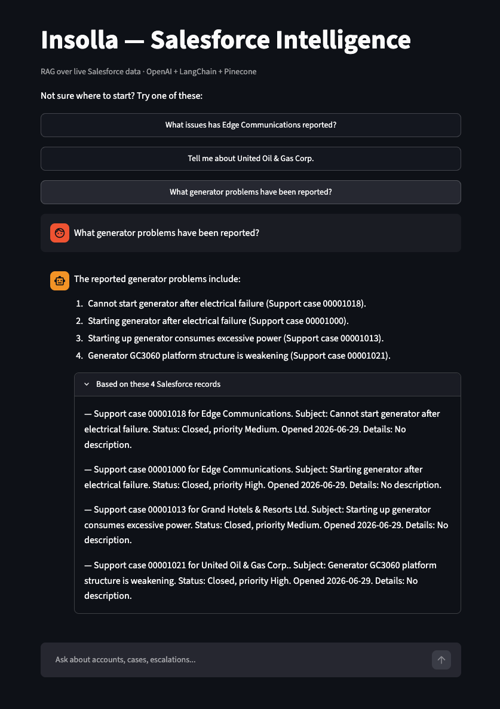

# Insolla-Salesforce-RAG

A RAG (Retrieval-Augmented Generation) app that pulls support cases and account
data from a Salesforce dev org, embeds it into Pinecone, and answers
natural-language questions about it, grounded in the actual data, with
sources shown for every answer.

**Stack:** Python · OpenAI (embeddings + chat) · LangChain · Pinecone ·
Streamlit · Salesforce (`simple-salesforce`, OAuth 2.0 JWT Bearer flow)

**🔗 Live demo:** https://insolla-salesforce-rag-kjfm8hmmbzqm6j3hmyjeth.streamlit.app/



## Architecture

```
Salesforce API → JSON records → text docs → OpenAI embeddings → Pinecone
                                                                    │
User question → embed question → similarity search (top-k) → prompt + context → LLM → answer
```

1. **`extract.py`**: pulls Cases and Accounts from Salesforce via SOQL.
2. **`documents.py`**: converts each structured record into a plain-English
   paragraph (embedding models work on natural language, not raw JSON).
3. **`ingest.py`**: embeds every document (`text-embedding-3-small`) and
   stores the vectors in a Pinecone index.
4. **`rag.py`**: at question time, embed the question, retrieve the
   nearest `k=4` document vectors, then hand them to the LLM (`gpt-4o-mini`,
   `temperature=0`) as context, with an explicit instruction not to answer
   beyond that context.
5. **`app.py`**: Streamlit chat UI over `rag.py`, showing the retrieved
   source records alongside every answer.

## Setup

```
python3.12 -m venv .venv
source .venv/bin/activate
pip install -r requirements.txt
```

Fill in `.env` (see `.env` for the required keys: OpenAI, Pinecone, and
Salesforce auth). Salesforce auth uses OAuth 2.0 JWT Bearer flow (certificate
in `certs/`, not committed) rather than the classic username/password/security
token combo. See "Salesforce auth" below for why.

```
python extract.py      # pull Salesforce data → sf_data.json
python ingest.py        # embed + store in Pinecone
python test_retrieval.py  # sanity-check semantic search
streamlit run app.py    # launch the demo UI
```

## Salesforce auth: why JWT Bearer flow

Salesforce has been retiring credential-based SOAP `login()` org-wide, and
new orgs also block the OAuth 2.0 username-password flow by default; both
are being phased out in favor of provable-identity flows. This app
authenticates via the **OAuth 2.0 JWT Bearer flow** instead: a self-signed
certificate proves the app's identity, and no password is ever transmitted.
This is also the standard pattern for real server-to-server Salesforce
integrations, not just a workaround.

## What I'd do for production

- **Incremental sync**: pull only records modified since the last run
  (`WHERE LastModifiedDate > ...`) and upsert into Pinecone, instead of a
  full re-embed every time.
- **Retrieval evaluation**: a small labeled set of question/expected-answer
  pairs to catch retrieval regressions when `*_to_text` formatting or `k`
  changes, rather than eyeballing answers.
- **Cost monitoring**: track embedding + completion token usage per query;
  `k` directly trades off recall against both noise and per-query cost.
- **Conversational memory**: multi-turn chat that remembers prior context
  (currently every question is answered independently).
- **Broader auth**: the JWT Bearer flow here authenticates as a single
  pre-authorized user; a multi-user production app would use full OAuth
  authorization-code flow with per-user consent.
